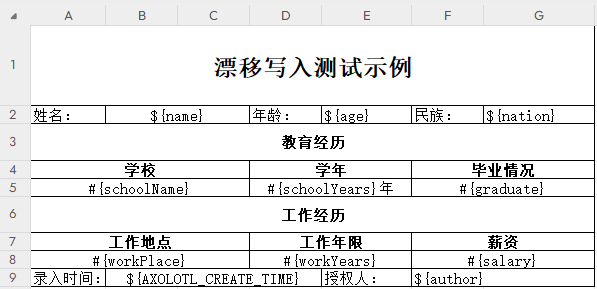
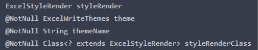
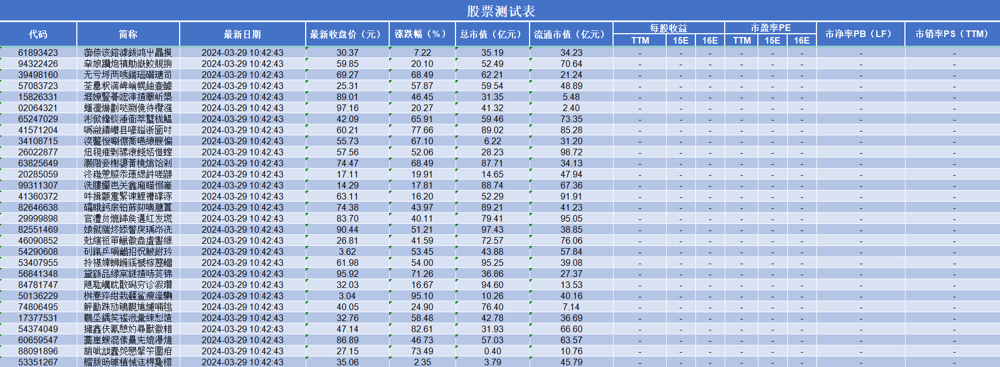
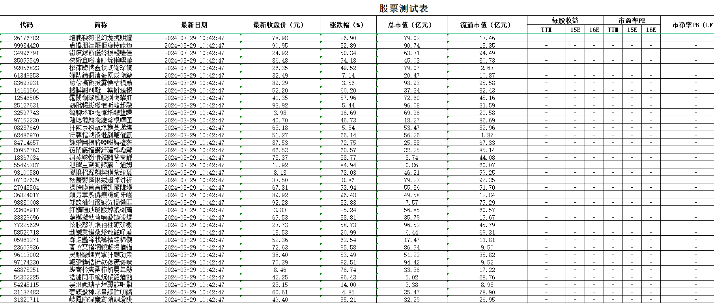
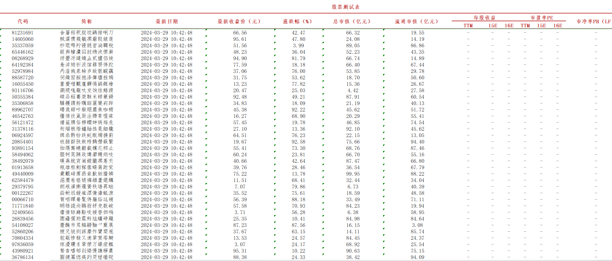
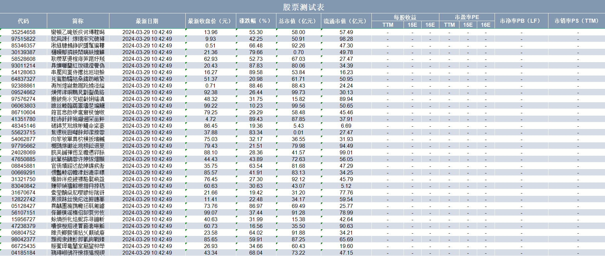
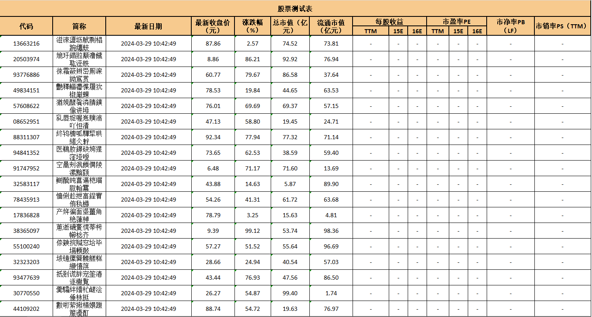

# Axolotl 文档处理框架


## Part.1 简介

**✨此项目目前处于ALPHA版本✨**

------


<div style='display:flex'>
    <div>
        
    </div>
     <div style='margin:20px'>
         <p>
         &nbsp;&nbsp;&nbsp;&nbsp;	此项目基于 Apache POI 框架，用于处理文档内容如Excel工作簿等。
         </p>
         <p>
         &nbsp;&nbsp;&nbsp;&nbsp;	通过该框架，用户可以轻松读取、写入、以及操作文件中的数据，支持对不同格式的文件进行处理。
         </p>
          <p>
          &nbsp;&nbsp;&nbsp;&nbsp;	项目利用 Apache POI 提供的丰富功能，实现了对大型文档的高效处理，并提供了灵活的接口，方便用户根据需求定制化操作。
         </p>
          <p>
          &nbsp;&nbsp;&nbsp;&nbsp;	无论是数据导入、导出，还是对内容进行复杂的编辑和分析，此框架都为用户提供了便捷而强大的解决方案，使得文档的处理变得更加高效、灵活。
         </p>
    </div>
</div>


> Axolotl意为美西螈（ˈæksəˌlɒtəl），总的来说，美西螈以其独特的外观、再生能力和生活习性而备受关注。


### 1.1 版本更新说明

#### 🔝Java17 版本 <font color='red'>1.0.13</font> 更新说明

发布时间：[2024-03-29]

- 正式发布Java17版本。

- 自动写入功能进入支持阶段。

- 升级VOID-TOOLKIT依赖。

- 统一API命名规则。

- 迁移写入器部分代码结构。

- Java8版本进入补丁修复阶段。

#### 🧩历史版本更新说明

请参考文件 [📂ChangeLog变更记录说明](docs.assets/changelog/Index.md)

## Part.2 目前支持功能

|  支持的文件格式   | 目前支持功能 |
| :---------------: | :----------: |
| Excel(.xlsx,.xls) |  导入/导出   |
|     PDF(.pdf)     |  🔜计划支持   |

## Part.3 如何开始使用

### 3.1 添加Maven依赖

**⛔<font color='red'>Java17版本（LTS版本，推荐使用）</font>**

```xml
<dependency>
    <groupId>cn.toutatis</groupId>
    <artifactId>axolotl</artifactId>
    <version>1.0.13</version>
</dependency>
```

**✅<font color='red'>Java8版本()</font>**

```xml
<dependency>
    <groupId>cn.toutatis</groupId>
    <artifactId>axolotl</artifactId>
    <version>0.0.10-ALPHA-8</version>
</dependency>
```

### 3.2 Excel 文档操作

#### 3.2.1 读取Excel文件

📖Excel文件支持类型：

| MIME-TYPE                                                    |         说明          | 文件后缀 |
| :----------------------------------------------------------- | :-------------------: | :------: |
| application/vnd.ms-excel                                     | Excel 97-2003文件版本 |  [.xls]  |
| application/vnd.openxmlformats-officedocument.spreadsheetml.sheet | Excel 2007及以上版本  | [.xlsx]  |

##### 3.2.1.1 构建文档读取器

```java
// 使用静态方法获取Excel读取器（推荐）
AxolotlExcelReader<Object> excelReader1 = Axolotls.getExcelReader(file);
// 流读取支持
AxolotlExcelReader<Object> excelInsReader = Axolotls.getExcelReader(inputStream);
// 或者使用构造方法创建
AxolotlExcelReader<Object> excelReader2 =new AxolotlExcelReader<>(excelFile);
```

##### 3.1.1.2 读取Excel内容

```java
// 1.打开一个Excel文件
File file = new File("打开一个Excel文件.xlsx");
// 2.新建一个Excel读取器
AxolotlExcelReader<Object> excelReader = Axolotls.getExcelReader(file);
// 3.读取数据
List<Object> data = excelReader.readSheetData();
System.out.println(data);
```

#### 3.2.2 写入Excel文件

​	本框架支持写入XLSX文件。

##### 3.2.2.1 构建文档写入器

```java
// 最重要的是需要创建写入配置
WriterConfig commonWriteConfig = new WriterConfig();
// 创建模板Excel写入器
File file = FileToolkit.getResourceFileAsFile("写入模板.xlsx");
AxolotlExcelWriter axolotlAutoExcelWriter = Axolotls.getTemplateExcelWriter(file, commonWriteConfig);
// 创建普通Excel写入器
AxolotlExcelWriter axolotlAutoExcelWriter = Axolotls.getExcelWriter(commonWriteConfig);
```

##### 3.2.2.2 两种写入方式

###### <1> 模板写入

```java
// 获取数据
Map<String, Object> map = Map.of("name", "Toutatis");
List<TestEntity> datas = new ArrayList<>();
// 调用模板写入方法
axolotlAutoExcelWriter.writeToTemplate(0, map, datas);
```

###### <2> 预设样式写入

```
// 等待支持
```

### 3.3 PDF 文档操作

```
// TODO 等待支持
```

## Part.4 详细使用说明

### 4.1 Excel操作

#### 4.1.1 Excel文档读取

🔆在构建AxolotlExcelReader后，**使用readSheetData(args)读取数据**，readSheetData有多种形参方法，详情请查看readSheetData方法源代码，基本上均为readSheetData(ReaderConfig readerConfig)的变种使用[【📌点击跳转至对应章节】](#Anchor-ConfigRead)。


🔆框架支持读取Excel为List<T>或者为单个Object实例。

```java
// 将所有实体属性指定为@SpecifyPositionBind可以读取为一个Object
POJO data = reader.readSheetDataAsObject(ReaderConfig readerConfig)
// 读取excel为List数据
List<POJO> data = reader.readSheetData(ReaderConfig readerConfig)
```


##### 4.1.1.1 注解说明

| 注解（annotations）                   | 用途                                            | 参数说明                                                     |
| ------------------------------------- | ----------------------------------------------- | ------------------------------------------------------------ |
| @IndexWorkSheet                       | [Class]<br />指定具体索引的工作表               | [readRowOffset]读取起始偏移行<br />[sheetIndex]工作表索引[默认值:0]<br />[sheetColumnEffectiveRange]工作表列有效范围[默认范围:{0,-1}] |
| @NamingWorkSheet                      | [Class]<br />指定具体名称的工作表（区分大小写） | [readRowOffset]读取起始偏移行<br />[sheetName]工作表名称     |
| <font color='red'>@ColumnBind*</font> | [Property]<br />实体绑定列位置                  | [columnIndex]列索引<br />[format]日期格式化（数据格式化暂不支持）<br />[adapter]数据适配器<br />[headerName]表头名称<br /> |
| @SpecifyPositionBind                  | [Property]<br />实体绑定具体单元格位置          | [value]单元格位置[举例:A1,B2,C3]<br />[format]日期格式化（数据格式化暂不支持）<br />[adapter]数据适配器 |
| @KeepIntact                           | [Property]<br />赋值字段时排除读取策略          | [excludePolicies]排除的读取策略                              |

🧭POJO示例：

```java
@Data
// 指定索引工作表
@IndexWorkSheet(sheetIndex=0)
public class TestEntity {

    // JSR-303支持
    @NotBlank
    // 读取第0列
    @ColumnBind(columnIndex = 0)
    private String name;

    @Min(value = 1,message = "AAA")
    // 排除特性
    @KeepIntact(excludePolicies = ReadPolicy.CAST_NUMBER_TO_DATE)
    private int age;
    
    // 可以指定列表头对应的列位置
    @ColumnBind(headerName = "备注")
    private String remark;
    
    // 指定具体的单元格位置
    @SpecifyPositionBind("A1")
    private String title;

}
```

##### 4.1.1.2 迭代器支持

​	读取数据量大时支持迭代器读取。

```java
AxolotlExcelReader<POJO> excelReader = Axolotls.getExcelReader(file, POJO.class);
// 配置表级配置（一般不推荐配置，属于内部维护变量）
excelReader.set_sheetLevelReaderConfig(readerConfig);
while (excelReader.hasNext()){
	List<POJO> next = excelReader.next();
}
```

##### 4.1.1.3 [重要]以读取配置为参数读取<span id="Anchor-ConfigRead"> </span>

​	一般读取来说，若无特殊读取需求，可以直接构造读取器。

```java
AxolotlExcelReader<TestEntity> reader = Axolotls.getExcelReader(file.getInputStream(), TestEntity.class);
// 根据方法中不同形参读取
List<TestEntity> list = reader.readSheetData(7);
```

​	🔆若是需要更灵活的配置需要构造ReaderConfig配置类。

​	readSheetData的根读取方法为 **<font color="red">readSheetData(readerConfig)</font >**

```java
ReaderConfig<CastClass> readerConfig = new ReaderConfig<>(castClass);
List<TestEntity> list = reader.readSheetData(readerConfig);
```

📖ReaderConfig可配置项：

| 配置项                            | 说明                                             | 必填 | 默认值       |
| --------------------------------- | ------------------------------------------------ | ---- | ------------ |
| 构造器(Class<T> castClass)        | 设置读取类                                       | 是   | 无           |
| 构造器(boolean withDefaultConfig) | 是否使用默认配置                                 | 是   | True         |
| Class<T> castClass                | 设置读取类                                       | 是   | 无           |
| sheetIndex                        | 工作表索引                                       | 否   | 0            |
| sheetName                         | 工作表名称                                       | 否   | 无           |
| initialRowPositionOffset          | 初始行偏移量                                     | 否   | 0            |
| startIndex                        | 读取起始行                                       | 否   | 0            |
| endIndex                          | 读取结束行                                       | 否   | -1（所有）   |
| <del>indexMappingInfos</del>      | 索引映射<br />（一般不用指定）                   | 否   | 无           |
| <del>positionMappingInfos</del>   | 单元格映射<br />（一般不用指定）                 | 否   | 无           |
| rowReadPolicyMap                  | 策略集合                                         | 否   | 参考默认策略 |
| searchHeaderMaxRows               | 搜索表头最大行                                   | 否   | 10           |
| sheetColumnEffectiveRange         | 工作表有效列范围<br />arr[1] = -1表示该Row所有列 | 否   | {0,-1}       |

##### 4.1.1.4 读取策略说明

​	在读取Excel文件数据时，读取到数据时会有默认的读取策略。

​	在使用ReaderConfig时，可以使用以下方法指定读取策略。

```java
// 使用 new ReaderConfig<>(false);可取消所有读取策略，基本上以异常抛出形式作为错误，默认为true，包含以下所有默认读取策略
ReaderConfig<T> readerConfig = new ReaderConfig<>(castClass);
// 使用setBooleanReadPolicy方法可指定读取策略
// 在此实例中，忽略空表异常（IGNORE_EMPTY_SHEET_ERROR）指定为true时，将返回一个空的读取列表，在指定为false时将抛出空表异常
readerConfig.setBooleanReadPolicy(ReadPolicy.IGNORE_EMPTY_SHEET_ERROR, false);
```

📖读取策略说明：

| 读取策略枚举                    | 中文说明                                                     | 策略类型 | 是否为默认策略 | 默认值 |
| ------------------------------- | ------------------------------------------------------------ | -------- | -------------- | ------ |
| IGNORE_EMPTY_SHEET_ERROR        | 忽略空表异常                                                 | Boolean  | true           | true   |
| IGNORE_EMPTY_SHEET_HEADER_ERROR | 忽略空表头的错误                                             | Boolean  | true           | true   |
| SPREAD_MERGING_REGION           | 将合并的单元格展开到合并单元格的各个单元格                   | Boolean  | true           | true   |
| INCLUDE_EMPTY_ROW               | 空行也视为有效数据                                           | Boolean  | true           | false  |
| SORTED_READ_SHEET_DATA          | 在使用Map接收时，使用LinkedHashMap                           | Boolean  | true           | true   |
| CAST_NUMBER_TO_DATE             | 判断数字为日期类型将转换为日期格式                           | Boolean  | true           | true   |
| DATA_BIND_PRECISE_LOCALIZATION  | 指定此特性,在按行读取时,若没有指定列名,将不会绑定对象属性<br />否则将按照实体字段顺序自动按照索引绑定数据 | Boolean  | true           | true   |
| TRIM_CELL_VALUE                 | 修整单元格去掉单元格所有的空格和换行符                       | Boolean  | true           | true   |
| USE_MAP_DEBUG                   | 使用Map接收数据时，打印调试信息                              | Boolean  | true           | true   |
| FIELD_EXIST_OVERRIDE            | 如果字段存在值覆盖掉原值                                     | Boolean  | true           | true   |
| **VALIDATE_READ_ROW_DATA**      | 读取数据后校验数据                                           | Boolean  | true           | true   |

##### 4.1.1.5 JSR-303支持（数据校验）

本框架支持Bean Validation,使用Hibernate-Validator进行实体属性校验。

详情请参考 [📂【Hibernate-Validator 8.0.1.Final 使用手册】](docs.assets\hibernate_validator_reference.pdf) (Java8版本使用为6.2.5.Final)

📖一般POJO类使用注解如下：

| **注解**                    | 说明                                                         |
| --------------------------- | ------------------------------------------------------------ |
| @Nul                        | 被注释的元素必须为 Null                                      |
| @NotNull                    | 被注释的元素必须不为 Null                                    |
| @AssertTrue                 | 被注释的元素必须为 True                                      |
| @AssertFalse                | 被注释的元素必须为 False                                     |
| @Min(value)                 | 被注释的元素必须是一个数字，其值必须大于等于指定的最小值     |
| @Max(value)                 | 被注释的元素必须是一个数字，其值必须小于等于指定的最大值     |
| @DecimalMin(value)          | 被注释的元素必须是一个数字，其值必须大于等于指定的最小值     |
| @DecimalMax(value)          | 被注释的元素必须是一个数字，其值必须小于等于指定的最大值     |
| @Size(max, min)             | 被注释的元素的大小必须在指定的范围内，元素必须为集合，代表集合个数 |
| @Pattern(regexp = )         | 正则表达式校验                                               |
| @Digits (integer, fraction) | 被注释的元素必须是一个数字，其值必须在可接受的范围内         |
| @Past                       | 被注释的元素必须是一个过去的日期                             |
| @Future                     | 被注释的元素必须是一个将来的日期                             |
| @Email                      | 被注释的元素必须是电子邮箱地址                               |
| @Length(min=, max=)         | 被注释的字符串的大小必须在指定的范围内，必须为数组或者字符串，若微数组则表示为数组长度，字符串则表示为字符串长度 |
| @NotEmpty                   | 被注释的字符串的必须非空                                     |
| @Range(min=, max=)          | 被注释的元素必须在合适的范围内                               |
| @NotBlank                   | 被注释的字符串的必须非空                                     |
| @URI                        | 字符串是否是一个有效的URL                                    |

##### 4.1.1.6 异常处理

​	在读取文件时难免会有读取错误的情况，在发生读取异常时会抛出**AxolotlExcelReadException**来提示异常信息。

**🔆推荐使用为在Web框架使用时向上层抛出异常，在全局异常处理器中统一返回错误信息**

📖AxolotlExcelReadException异常中包含以下内容：

| 可获取内容             | 说明                                   |
| ---------------------- | -------------------------------------- |
| message                | 错误信息                               |
| currentReadRowIndex    | 当前读取行数                           |
| currentReadColumnIndex | 当前读取列数                           |
| humanReadablePosition  | 良好可读性的错误位置（示例：A5单元格） |
| fieldName              | 错误的实体属性                         |
| exceptionType          | 读取错误类型                           |

📖AxolotlExcelReadException.ExceptionType错误类型说明：

| 错误枚举             | 说明                        |
| -------------------- | --------------------------- |
| READ_EXCEL_ERROR     | 读取Excel文件时出现了异常   |
| READ_EXCEL_ROW_ERROR | 读取Excel数据时，出现了异常 |
| CONVERT_FIELD_ERROR  | 转换数据时出现异常          |
| VALIDATION_ERROR     | 校验数据时出现异常          |

##### 4.1.1.7 StreamReader流读取器支持

​	在读取大的Excel文件（文件大小>=15M）时，将文件转换为数据加载进内存时会占用大量的时间和内存，在单个Sheet中数据40w行数据左右时将占用10G内存,时间在1min左右。

​	在读取此类大文件时可以使用 **AxolotlStreamExcelReader** 以流的方式读取数据，减少加载时间和内存占用，该读取器相较于**AxolotlExcelReader** 失去了很多特性，例如获取指定位置数据，分页等。

​	<font color='orange'>**在使用流读取器时只能使用迭代器获取表中数据，并且只能支持XLSX格式。**</font>

```java
// 获取流读取器
AxolotlStreamExcelReader<Object> streamExcelReader = Axolotls.getStreamExcelReader(file);
int recordRowNumber = streamExcelReader.getRecordRowNumber();
System.err.println(recordRowNumber);
// 构建配置（在流读取下表位置，开始位置，结束位置等设置均无用）
ReaderConfig<TestEntity> readerConfig = new ReaderConfig<>(TestEntity.class);
// 获取迭代器
AxolotlExcelStream<TestEntity> dataIterator = streamExcelReader.dataIterator(readerConfig);
int idx = 0;
// 读取数据
while (dataIterator.hasNext()){
	TestEntity entity = dataIterator.next();
	System.out.println(idx+"="+entity);
	idx++;
}
```

​        在读取此类大文件时可以使用 **AxolotlStreamExcelReader** 以流的方式读取数据，减少加载时间和内存占用，该读取器相较于**AxolotlExcelReader** 失去了很多特性，例如获取指定位置数据，分页等。

##### 4.1.1.8 数据适配器

​	**数据适配器（DataCastAdapter）**用于将Excel单元格转换为Java实体对应属性的的处理器，在获取到单元格数据时适配为转换类实例对象中对应字段类型并赋值。

**📖适配器的配置：**

1. 通过注解指定adapter:

```
@ColumnBind(headerName = "工程名称",adapter = DefaultStringAdapter.class)
private String a1;

@SpecifyPositionBind(value = "A1",adapter = DefaultStringAdapter.class)
private String a2;
```

​	可在注解 **@ColumnBind与@SpecifyPositionBind** 中直接指定该属性使用的适配器，需注意适配器是否支持该属性类型与单元格类型的转换。

------

2. 全局指定

全局指定时可通过配置**DefaultAdapters**类实现，**注解指定优先级高于全局指定**。

（有关默认适配器信息请看下一小节）

------

📖DefaultAdapters[默认适配器]：

​	默认数据适配器，框架为**基本数据类型以及常用Java类**提供预设数据适配器。

- **DefaultBooleanAdapter**（布尔类处理器）-> STRING,BOOLEAN,NUMERIC -> Boolean
- **DefaultDateTimeAdapter**（时间类适配器）-> STRING,NUMERIC -> LocalDateTime等
- **DefaultNumericAdapter**（数字类适配器）-> STRING,NUMERIC -> Interger等
- **DefaultStringAdapter**（字符串类处理器）-> ALL -> String

> 通过DefaultAdapters该类方法可完成全局适配器的配置，使用**registerDefaultAdapter**方法注册全局适配器，使用**removeDefaultAdapter**方法移除全局适配器（**基础类型适配器不能被移除**）。

添加其他适配器为默认适配器：

```java
// 调用registerDefaultAdapter方法注册一个适配器为全局适配器
// clazz为需要转换的Java类型
DefaultAdapters.registerDefaultAdapter(clazz,adapter);
```

移除默认适配器：

```java
// clazz为需要转换的Java类型
DefaultAdapters.removeDefaultAdapter(clazz);
```

------

<font color='red'>**📖自定义适配器：** </font>

所有适配器都为**DataCastAdapter** 接口实现类。

**DataCastAdapter接口：**

```java
public interface DataCastAdapter<FT> {

    /**
     * 类型转换
     * @param cellGetInfo 单元格信息
     * @param context 类型转换所需的上下文
     * @return 转换后的值
     */
    FT cast(CellGetInfo cellGetInfo, CastContext<FT> context);

    /**
     * 是否支持该类型进行转换
     * @param cellType 单元格类型
     * @param clazz 需要转换的类型
     * @return 是否支持该类型进行转换
     */
    boolean support(CellType cellType, Class<FT> clazz);

}
```

接口中有两个方法**cast（转换）**与**support（是否支持转换）**。

------

<font color='orange'>cast方法: </font>

​	将**Excel的单元格类型**转换为**Java类型**的方法，转换逻辑在此方法中实现。

方法形参:

| 参数                    | 说明                             |
| ----------------------- | -------------------------------- |
| CellGetInfo cellGetInfo | 单元格信息:包含数据,单元格类型等 |
| CastContext context     | 转换上下文:包含转换字段类型等    |

**cellGetInfo** 为单元格相关信息，**context **为类型转换所需的上下文信息

------

<font color='orange'>support方法：</font>

​	判断该适配器是否支持从单元格类型转换为Java字段类型。

​	**cellType** 为单元格类型，**clazz** 为Java类型，返回**true**说明该适配器支持转换，反之不支持转换并抛出异常。

------

适配器抽象基类 **AbstractDataCastAdapter(推荐使用)**

框架中的默认实现皆由此类实现：

```java
public abstract class AbstractDataCastAdapter<FT> implements DataCastAdapter<FT> {

    /**
     * 读取配置
     */
    private ReaderConfig<?> readerConfig;

    /**
     * 实体映射信息
     */
    private EntityCellMappingInfo<?> entityCellMappingInfo;

}
```

​	**AbstractDataCastAdapter** 提供了读取配置**readerConfig**与实体映射信息**entityCellMappingInfo**两种**配置信息**供开发者在编写适配器时使用。

| 参数                                           | 说明                                                         |
| ---------------------------------------------- | ------------------------------------------------------------ |
| ReaderConfig<?> readerConfig                   | 为读取表格时的相关配置信息，包括已启用的读取特性、读取的sheet表相关信息、读取表头的范围信息（当以表头名称绑定列时可用）、实体类属性与表格的映射信息（所有属性）以及读取的行次、列次范围信息等等。 |
| EntityCellMappingInfo<?> entityCellMappingInfo | 主要为当前属性的相关映射信息，如属性类型、属性名称、对应单元格的行次列次、单元格映射类型以及该属性排除的读取特性等等。 |

##### 4.1.1.9 实体读取相关信息

​	在实体中指定字段类型为**AxolotlReadInfo**时候，读取表中数据将自动赋值该字段，该类中包含以下内容。

📖AxolotlReadInfo字段：

|  字段名称  |        说明        |
| :--------: | :----------------: |
| sheetIndex |     工作表索引     |
| sheetName  |     工作表名称     |
| rowNumber  | 工作表中该实体行号 |

​	<font color='red'>**每个实体中仅支持一个该字段属性，其余相同类型字段将被覆盖。**</font>

#### 4.1.2 Excel文档写入

​	<font color='orange'>**本框架仅支持XLSX文件写入，性能更优异兼容更好。**</font>

> <font color='red'>**所有写入方法注意事项：大批量写入时避免合并单元格写入，将降低大量性能！！！**</font>
>
> <font color='red'>**所有写入方法注意事项：大批量写入时避免合并单元格写入，将降低大量性能！！！**</font>
>
> <font color='red'>**所有写入方法注意事项：大批量写入时避免合并单元格写入，将降低大量性能！！！**</font>

##### 4.1.2.1 模板文件写入

​	确保你已经准备好一个模板文件，该文件包含了你希望在其中填充数据的格式，例如，包含了表头、样式等。

​	模板写入将根据模板中占位符替换数据。

###### 📖使用方法：

```java
// 添加一个模板文件
File file = FileToolkit.getResourceFileAsFile("workbook/write/.xlsx");
//创建写入配置
WriterConfig commonWriteConfig = new WriterConfig();
FileOutputStream fileOutputStream = new FileOutputStream("D:\\" + IdUtil.randomUUID() + ".xlsx");
commonWriteConfig.setOutputStream(fileOutputStream);
// 创建写入器
try (AxolotlExcelWriter axolotlAutoExcelWriter = new AxolotlExcelWriter(file, commonWriteConfig)) {
    // 获取数据
    Map<String, Object> map = Map.of("name", "Toutatis","nation","汉");
    axolotlAutoExcelWriter.writeToTemplate(0, map, null);
    ArrayList<JSONObject> datas = new ArrayList<>();
    for (int i = 0; i < 3; i++) {
        JSONObject sch = new JSONObject();
        sch.put("schoolName","北京-"+RandomStringUtils.randomAlphabetic(16));
        sch.put("schoolYears", RandomUtil.randomBigDecimal(BigDecimal.ZERO, BigDecimal.TEN).setScale(0, RoundingMode.HALF_UP));
        sch.put("graduate", true);
        datas.add(sch);
    }
    // 调用写入模板方法
    axolotlAutoExcelWriter.writeToTemplate(0, Map.of("age",50), datas);
}
```

###### 📖占位符(占位符区分大小写)：

​	<font color='orange'>**模板写入必须要在模板单元格中指定占位符。**</font>

| 占位符 |                             说明                             |     示例      |
| :----: | :----------------------------------------------------------: | :-----------: |
|  ${}   |              映射占位符<br />占位符只能使用一次              |    ${name}    |
|  #{}   |        列表数据占位符<br />写入多条数据时指定该占位符        | #{schoolName} |
|  &{}   | 合计占位符**（仅支持合计列表数据）**<br />使用方法和映射占位符一致 |   &{money}    |

**占位符默认值：**

​	在使用占位符时，如果数据为空（null，不是空字符串）时，可使用占位符指定默认值。

| 占位符格式          | 说明                                           |
| ------------------- | ---------------------------------------------- |
| ${admin:系统管理员} | map中，admin为null时将被填充为系统管理员字符串 |
| #{money:0}          | 列表数据中金额为null时将被填充为0              |

###### 📖内置常量：

​	写入模板数据时,框架拥有一些内置常量。

|      常量名称       |                  说明                   |
| :-----------------: | :-------------------------------------: |
| AXOLOTL_CREATE_TIME | 当前写入时间[格式：yyyy-MM-dd hh:MM:ss] |
| AXOLOTL_CREATE_DATE |     当前写入日期[格式：yyyy-MM-dd]      |

​	🧭示例表格:



##### 4.1.2.2 自动写入

###### 📖说明：

​	自动写入为按照预定的主题/样式写入数据。

###### 📖使用方法：

```java
// 初始化写入文件
FileOutputStream fos = new FileOutputStream("D:\\test.xlsx");
AutoWriteConfig commonWriteConfig = new AutoWriteConfig();
// 设置写入相关信息
commonWriteConfig.setTitle("股票测试表");
commonWriteConfig.setBlankValue("-");
commonWriteConfig.setOutputStream(fos);
// 设置表头
List<Header> headers = new ArrayList<>();
headers.add(new Header("代码","code"));
headers.add(new Header("简称","intro"));
headers.add(new Header("最新日期","localDateTimeStr"));
headers.add(new Header("最新收盘（元）",StockEntity::getClosingPrice));
headers.add(new Header("涨跌幅（%）",StockEntity::getPriceLimit));
headers.add(new Header("总市值（亿元）",StockEntity::getTotalValue));
headers.add(new Header("流通市值（元）",StockEntity::getCirculationMarketValue));
List<Header> subHeader1 = List.of(new Header("TTM"), new Header("15E"),new Header("16E"));
headers.add(new Header("每股收益", subHeader1));
headers.add(new Header("市盈率PE", subHeader1));
headers.add(new Header("市净率PB（LF）"));
headers.add(new Header("市销率PS（TTM）","pts"));
// 创建写入数据
ArrayList<StockEntity> data = new ArrayList<>();
for (int i = 0; i < 50; i++) {
	StockEntity stockEntity = new StockEntity();
    stockEntity.setCode(RandomStringUtils.randomNumeric(8));
    // ...忽略字段写入
    data.add(stockEntity);
}
//创建写入器
AxolotlAutoExcelWriter autoExcelWriter = Axolotls.getAutoExcelWriter(commonWriteConfig);
autoExcelWriter.write(headers,data);
autoExcelWriter.close();
```

######  📖核心类说明：

1. 表头Header:

    ​	Header类为工作表的表头，使用autoExcelWriter.write(**headers**,data)方法写入数据时将为工作表创建表头，支持嵌套表头， 表现为多行合并表头。在**主题说明**章节处可以查看样式。 

    **📖表头属性说明：**

    | 属性                   | 说明           | 备注                                                         |
    | ---------------------- | -------------- | ------------------------------------------------------------ |
    | name                   | 表头标题       | 表头显示名称。                                               |
    | fieldName              | 数据字段映射   | 实体类的对应字段，指定该字段后写入将只按照映射写入，不按照数据的字段定义顺序写入列，必须指定所有字段映射，否则将置入空值，最底层节点生效。 |
    | childs                 | 子表头         | 当前表头的下级表头。                                         |
    | customCellStyle        | 表头自定义样式 | POI样式，适合高级使用。<br />优先级:高                       |
    | axolotlCellStyle       | 表头自定义样式 | 对于不熟悉POI的使用者使用此属性创建单元格样式，指定了customCellStyle后此属性将不生效。<br />优先级:低 |
    | columnWidth            | 当前表头的列宽 | 仅最底层节点生效。                                           |
    | participateInCalculate | 是否参与计算列 | 表头所对应列是否参与合计。（合计特性）<br />仅最底层节点生效。 |


###### 📖配置说明： 

​	写入配置使用AutoWriteConfig类进行写入。

**📖AutoWriteConfig配置属性说明：**

| 属性                    | 说明             | 备注                                                         |
| ----------------------- | ---------------- | ------------------------------------------------------------ |
| title                   | 工作表标题       | 配置此属性将创建工作表标题行样式。                           |
| sheetName               | 工作簿表名称     | 未配置此属性时将使用title属性值。                            |
| metaClass               | 数据类           | 配置此类将获取该类的表头标题等注解。                         |
| fontName                | 自定义字体名称   | 配置字体名称将覆盖主题默认字体。                             |
| **styleRender**         | **样式渲染器**   | **使用样式渲染器渲染内容。**                                 |
| dataInverter            | 数据转换器       | 将字段数据转为工作表数据。（默认渲染为字符串）<br />如有需要将在未来版本支持其他数据格式。 |
| blankValue              | 空值填充字符     | 写入数据时，实体类中Null值将被填充为空字符串。<br />常用的字符串有"","-","未填写","无"等。 |
| specialRowHeightMapping | 特殊行高映射     | 添加到此map的行次将配置行高。                                |
| calculateColumnIndexes  | 需要计算的列索引 | 在使用**自动在结尾插入合计行**特性时生效，默认计算所有列。<br />可能会将编号等字段也作为合计列，此时可以使用此字段自定义合计列。 |

###### 📖主题说明：

**🧭如何配置主题？**

​	使用**AutoWriteConfig**配置类调用**setThemeStyleRender**方法配置主题样式。

```java
AutoWriteConfig autoWriteConfig = new AutoWriteConfig();
autoWriteConfig.setThemeStyleRender(theme);
```



**🧭内置主题样式：**

<div align='center'>
    <font><b>Axolotl默认主题</b></font>
</div>



<div align='center'>
    <font><b>经典黑主题</b></font>
</div>



<div align='center'>
    <font><b>行政红主题</b></font>
</div>



<div align='center'>
    <font><b>雾霾蓝主题</b></font>
</div>



<div align='center'>
    <font><b>工业橙主题</b></font>
</div>



**🧭如何自定义主题或定制样式：**

​	[📂自定义主题说明书](docs.assets\writer\AutoWriterDetail.md) 

##### 4.1.2.3 写入策略

在写入数据时，支持写入策略来对数据进行处理。

| 策略名称                               | 使用范围 | 说明                               |
| -------------------------------------- | -------- | ---------------------------------- |
| AUTO_CATCH_COLUMN_LENGTH               | 自动写入 | 自动计算列长度                     |
| AUTO_INSERT_SERIAL_NUMBER              | 自动写入 | 自动在第一列插入编号               |
| AUTO_FILL_DEFAULT_CELL_WHITE           | 自动写入 | 默认填充单元格为白色               |
| AUTO_INSERT_TOTAL_IN_ENDING            | 自动写入 | 自动在结尾插入合计行               |
| TEMPLATE_SHIFT_WRITE_ROW               | 模板写入 | 数据写入自动将数据写入下移到下一行 |
| TEMPLATE_PLACEHOLDER_FILL_DEFAULT      | 模板写入 | 为没有指定的占位符填充默认值       |
| TEMPLATE_NULL_VALUE_WITH_TEMPLATE_FILL | 模板写入 | 空值是否使用模板填充               |
| TEMPLATE_NON_TEMPLATE_CELL_FILL        | 模板写入 | 非模板单元格是否模板填充           |
| EXCEPTION_RETURN_RESULT                | 通用     | 异常将返回结果，不抛出异常         |

### 4.2 PDF操作

```
// 等待Feature支持
```

### 4.3 通用支持

#### 4.3.1 调试信息

​	本框架将logging.level等级设置为<font color='RED'>**DEBUG**</font>可见调试信息。

🧭示例 log4j.properties 配置如下：

```ini
# Set root logger level to DEBUG and its only appender to console.
log4j.rootLogger=DEBUG, console

# console is set to be a ConsoleAppender.
log4j.appender.console=org.apache.log4j.ConsoleAppender

# console uses PatternLayout.
log4j.appender.console.layout=org.apache.log4j.PatternLayout
log4j.appender.console.Target = System.out
log4j.appender.console.Threshold = DEBUG
log4j.appender.console.layout.ConversionPattern=%-4r [%t] %-5p %c %x - %m%n
```

## Part.5 疑难解答

### 📛问题相关

#### 日志框架冲突

日志框架冲突,可将依赖中的日志框架移除。

```basic
SLF4J: Failed to load class "org.slf4j.impl.StaticLoggerBinder".
```

📖官网引用：

> This error is reported when the org.slf4j.impl.StaticLoggerBinder class could not be loaded into memory. This happens when no appropriate SLF4J binding could be found on the class path. Placing one (and only one) of slf4j-nop.jar, slf4j-simple.jar, slf4j-log4j12.jar, slf4j-jdk14.jar or logback-classic.jar on the class path should solve the problem.
>
> 翻译：无法将org.slf4j.impl.StaticLoggerBinder类装入内存。当在类路径上找不到适当的SLF4J绑定时，就会发生这种情况。将slf4j-nop.jar、slf4j-simple.jar、slf4j-log4j12.jar、slf4j-jdk14.jar或logback-classic.jar中的一个(且只有一个)放在类路径上应该可以解决这个问题。

```xml
<dependency>
	<groupId>org.apache.logging.log4j</groupId>
	<artifactId>log4j-api</artifactId>
	<version>2.17.1</version>
</dependency>
<dependency>
	<groupId>cn.toutatis</groupId>
	<artifactId>axolotl</artifactId>
	<version>0.0.8-ALPHA-8</version>
		<exclusions>
            <exclusion>
            	<groupId>org.slf4j</groupId>
                <artifactId>slf4j-log4j12</artifactId>
            </exclusion>
        </exclusions>
</dependency>
```

------

#### 合并单元格内容读取

​	读取<font color='red'>**合并单元格**</font>不同列时会读取到同样的内容，因为本框架**默认**采用的策略为散播策略（**SPREAD_MERGING_REGION** 可配置，默认开启），会将合并单元格的值散播到合并单元格的各个单元格上（原为合并单元格中第0行，第0列的值）。

### 🚸使用疑问

#### @ColumnBind注解中headerName的使用

​	该功能的是为了读取数据时直接按照表头名称读取对应列所设计，解决不同模板之间表头有差异造成读取列错位所设计的功能。
​	指定注解中此参数，会去读取工作表中查找<font color='orange'>**完全匹配**</font>的单元格字符串（例如：备注，地址）所对应的列位置转换为所对应的列索引作为读取列（如果有多个同名表头可指定**sameHeaderIdx**参数区分不同同名列），相当于转化为注解中的columnIndex参数。

📖<font color='orange'>**具体规则如下：**</font>

​	**列与实体类属性的绑定**：

​	**@ColumnBind**注解会根据属性中的**headerName**的值到工作表中进行单元格数据检索并绑定对应的列位置。
​	查找规则为按行从上至下依次检索<font color='grey' size='2'>[配置**searchHeaderMaxRows**进行修改]</font>该行每一列上的单元格，如果这些单元格中的值与配置的**headerName**的值完全匹配的情况下，那么该单元格的列位置会被判定为表头。

​	如果表头中只匹配到一个单元格的列，那么该**单元格所处的列**与该实体类属性绑定，如果备选区存在**多个同名表头**，可通过@ColumnBind注解的<font color='red'>sameHeaderIdx参数</font><font color='grey' size='2'>[默认为0]</font>指定同名表头索引，被指定的**单元格所处的列**会与该实体类属性绑定，**若不进行指定**，则按实体类**该属性所处位置**（在实体类中**headerName**参数**相同**的属性为一组，按属性声明的先后顺序**升序**排列，**属性所处位置**就是属性**在该组中的位置**，这个位置与**单元格在备选区的位置**对应）选择单元格进行列绑定。

🧭<font color='orange'>**使用建议：**</font>

1. 在使用**headerName**参数进行列绑定时，应首先配置**ReaderConfig**中的**searchHeaderMaxRows**属性确认表头范围，减少检索范围以提高效率并提高精准度。
2. 在使用**headerName**指定列位置时，应检查工作表范围内是否存在多个相同表头，建议在工作表为动态时应对工作表表头位置进行判断，在需要时可通过配置@ColumnBind注解的**sameHeaderIdx**参数手动指定备选表头索引进行列绑定。

<div style="float:right;padding-right:15px">
    提出人：<b>@zhangzk</b> 提出时间：<b>2024-02-03</b>  最后更新时间：<b>2024-02-26</b>
</div>

------

#### IDEA 引入相关包后import中报错但编译正常

​	出现该问题是由于XVOID包功能由其他语言支持，遇到此问题请升级IDEA到最新版。

<div style="float:right;padding-right:15px">
    提出人：<b>@zongzg</b> 提出时间：<b>2024-02-19</b> 
</div> 

------


## Part.6 相关链接

[📂GitHub VOID框架支持库](https://github.com/ToutatisGc/VOID)

[📂Apache POI官方网站](https://poi.apache.org/)

[📂Hibernate Validator官方网站](https://docs.jboss.org/hibernate/stable/validator/reference/en-US/html_single)

[📂Apache PDFBox官方网站](https://pdfbox.apache.org/)

[📂Apache Tika官方网站](https://tika.apache.org/)

