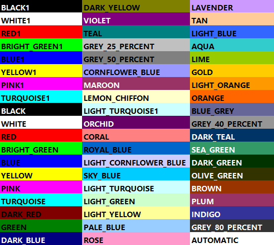
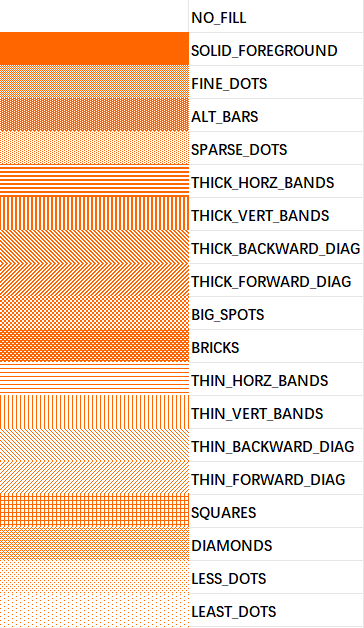

# Axolotl自定义主题说明


Author: Toutais_Gc zhangzk

## Part.1 概述

​	Axolotl系统提供了强大的自动写入Excel功能，使用户能够轻松地将系统中的数据导出到Excel文件中。通过主题配置，用户可以实现对生成Excel文件样式的统一管理，从而确保所有导出的数据都具有一致的外观和格式。

## Part.2 标准主题配置

​	主题样式是通过实现`cn.toutatis.xvoid.axolotl.excel.writer.style.ExcelStyleRender`接口定制。使用此接口可完全按照开发者需求定制样式。

接口分为几个生命周期，在不同的生命周期下操作不同的数据和样式：

| 生命周期 | 方法名称     | 说明                                                         |
| -------- | ------------ | ------------------------------------------------------------ |
| 初始化   | init         | **初始化在多次写入中只生效一次。<br />**该阶段应当实现变量的注入和赋值，例如颜色的指定。 |
| 渲染表头 | renderHeader | **渲染表头在多次写入中只生效一次。<br />**该阶段应当实现标题的写入和表头的渲染。 |
| 渲染数据 | renderData   | 渲染数据列表中的数据。                                       |
| 结束阶段 | finish       | 关闭写入器前所执行的操作。                                   |

## Part.3 抽象类集成

​	 使用`ExcelStyleRender`类定制主题过于的自由并且需要大量的适配，推荐继承`AbstractStyleRender`类，该类中已经编写了基本所需的写入方法。

​	如果需要修改部分内容也可以重写其中的方法而不破坏调用时序。

**AbstractStyleRender类中的方法：**

| 方法                     | 说明                                                     |
| ------------------------ | -------------------------------------------------------- |
| isFirstBatch             | 判断是否是第一批写入数据。                               |
| checkedAndUseCustomTheme | **必须在初始化阶段调用。**<br />检查主题字体和主题颜色。 |
| fillWhiteCell            | 初始化填充空白表格样式。                                 |
| createTitleRow           | 创建标题行。                                             |
| mergeTitleRegion         | 合并标题行。                                             |
| defaultRenderHeaders     | 渲染表头的默认方法，支持Header嵌套。                     |
| defaultRenderNextData    | 使用主题样式渲染实体数据，每一个实体占用一行。           |
| renderColumn             | 渲染实体对应每一列的数据。                               |
| createFont               | 创建字体。                                               |
| createStyle              | 创建单元格样式。                                         |





## 可配置主题：

​          可配置主题 AxolotlConfigurableTheme 支持对标题、表头、内容的单元格进行自定义样式配置，有助于快速开发出满足需求的主题。

### ConfigurableStyleConfig 接口：

​         ConfigurableStyleConfig 是可配置主题的配置接口，该接口提供了自定义标题、表头、内容等单元格的样式配置方法，通过实现类重写这些方法来进行配置。

```java
public interface ConfigurableStyleConfig {

    /**
     * 配置全局样式<p>
     * 渲染器初始化时调用 多次写入时，该方法只会被调用一次。<p>
     * 全局样式配置优先级 AutoWriteConfig内样式有关配置 > 此处配置 > 预制值<p>
     * @param cellConfig  样式配置
     */
    default void globalStyleConfig(CellConfigProperty cellConfig){}

    /**
     * 配置程序写入的单元格样式<p>
     * 使用本框架提供的写入策略时由程序写入的行或列（如：自动在结尾插入合计行、自动在第一列插入编号） 更多策略参考 ExcelWritePolicy 枚举类<p>
     * 自动在结尾插入合计行：不配置则自动取上一行单元格的样式   行高：不配置则自动取上一行的行高   列宽：不支持配置，继承上一行<p>
     * 自动在第一列插入编号：表头的'序号'单元格行高配置不生效，样式配置、列宽配置生效，
     *                    剩余的序号单元格可进行样式配置、列宽配置、行高配置(行高优先级低，不建议配置)，若无配置则使用序号单元格后第一个单元格的样式，如                           不存在则使用全局样式配置，
     *                    列宽可配置，可控制编号列的列宽<p>
     * 渲染器初始化时调用 多次写入时，该方法只会被调用一次。<p>
     * 配置优先级 此处配置 > 全局样式<p>
     * 若要更多精细化的样式配置建议手动插入合计与编号列<p>
     * @param cellConfig  写入策略与对应单元格样式
     */
    @Deprecated
    default void commonStyleConfig(Map<ExcelWritePolicy,CellConfigProperty> cellConfig){}

    /**
     * 配置表头样式（此处为所有表头配置样式，配置单表头样式请在Header对象内配置）<p>
     * 渲染器渲染表头时调用<p>
     * 表头样式配置优先级   Header对象内配置 > 此处配置 > 全局样式<p>
     * @param cellConfig  样式配置
     */
    default void headerStyleConfig(CellConfigProperty cellConfig){}

    /**
     * 配置标题样式（标题是一个整体，此处为整个标题配置样式）<p>
     * 渲染器渲染表头时调用<p>
     * 标题样式配置优先级  此处配置 > 全局样式<p>
     * @param cellConfig  样式配置
     */
    default void titleStyleConfig(CellConfigProperty cellConfig){}

    /**
     * 配置内容样式<p>
     * 渲染内容时，每渲染一个单元格都会调用此方法<p>
     * 内容样式配置优先级  此处配置 > 全局样式<p>
     * @param cellConfig  样式配置
     * @param fieldInfo 单元格与内容信息
     */
    default void dataStyleConfig(CellConfigProperty cellConfig, AbstractStyleRender.FieldInfo fieldInfo){}
```


### 单元格可配置属性 CellConfigProperty：

```java
//单元格可配置属性  支持单元格行高、列宽与单元格常用样式的配置
public class CellConfigProperty {

    /**
     * 行高<p>
     * 预制值说明：行高在标题、表头、内容、程序常用样式中的预制值为四个不同的固定数值
     */
    private Short rowHeight;

    /**
     * 列宽<p>
     * 列宽是指单个单元格所处列的宽度，不是某一个整体的宽度<p>
     * 标题不支持配置列宽，标题列宽交由表头和内容进行控制<p>
     * 预制值说明：表头列宽：依据表头单元格的值经过计算得出  内容列宽：继承表头列宽，当没有表头时，指定一个固定的值作为列宽<p>
     * 列宽配置在开启自动列宽 AUTO_CATCH_COLUMN_LENGTH 策略时无效<p>
     * 生效问题：因为渲染次序的问题，内容会最后渲染，而列宽是影响一整列的，自然会影响到先前已渲染的表头，所以在内容样式中配置的列宽会覆盖在表头样式中配置的列宽
     */
    private Short columnWidth;

    /**
     * 单元格水平对齐方式
     */
    private HorizontalAlignment horizontalAlignment;

    /**
     * 单元格对齐方式
     */
    private VerticalAlignment verticalAlignment;

    /**
     * 背景颜色
     */
    private AxolotlColor foregroundColor;

    /**
     * 填充模式
     */
    private FillPatternType fillPatternType;

    /**
     * 边框样式
     */
    private AxolotlCellBorder border;

    /**
     * 字体样式
     */
    private AxolotlCellFont font;


}
```

### 边框样式 AxolotlCellBorder：

```java
public class AxolotlCellBorder {
    /**
     * 边框默认样式
     */
    private BorderStyle baseBorderStyle;

    /**
     * 边框默认颜色
     */
    private IndexedColors baseBorderColor;

    /**
     * 上边框样式
     */
    private BorderStyle borderTopStyle;

    /**
     * 上边框颜色
     */
    private IndexedColors topBorderColor;

    /**
     * 下边框样式
     */
    private BorderStyle borderBottomStyle;

    /**
     * 下边框颜色
     */
    private IndexedColors bottomBorderColor;

    /**
     * 左边框样式
     */
    private BorderStyle borderLeftStyle;

    /**
     * 左边框颜色
     */
    private IndexedColors leftBorderColor;

    /**
     * 右边框样式
     */
    private BorderStyle borderRightStyle;

    /**
     * 右边框颜色
     */
    private IndexedColors rightBorderColor;

}
```


### 字体样式 AxolotlCellFont：

```java
public class AxolotlCellFont {

    /**
     * 字体名称
     */
    private String fontName;

    /**
     * 是否加粗
     */
    private Boolean bold;

    /**
     * 字体大小
     */
    private Short fontSize;

    /**
     *字体颜色
     */
    private IndexedColors fontColor;

    /**
     *设置文字为斜体
     */
    private Boolean italic;

    /**
     * 使用水平删除线
     */
    private Boolean strikeout;


}
```


### 预制值：

预制值是**单元格可配置属性**的默认值，若某个**单元格可配置属性**未进行任何自定义配置则会使用预制值填充。

以下是一些**单元格可配置属性**的预制值 ⬇

```
//单元格水平对齐方式
defaultStyle.setHorizontalAlignment(HorizontalAlignment.CENTER);
//单元格垂直对齐方式
defaultStyle.setVerticalAlignment(VerticalAlignment.CENTER);
//单元格背景色
defaultStyle.setForegroundColor(StyleHelper.WHITE_COLOR);
//单元格填充方式
defaultStyle.setFillPatternType(FillPatternType.SOLID_FOREGROUND);
//单元格边框样式（四边）
defaultStyle.setBaseBorderStyle(BorderStyle.NONE);
//单元格边框颜色（四边）
defaultStyle.setBaseBorderColor(IndexedColors.BLACK);
//单元格字体名称
defaultStyle.setFontName(StyleHelper.STANDARD_FONT_NAME);
//单元格字体颜色
defaultStyle.setFontColor(IndexedColors.BLACK);
//单元格字体是否加粗
defaultStyle.setBold(false);
//单元格字体大小
defaultStyle.setFontSize(StyleHelper.STANDARD_TEXT_FONT_SIZE);
//单元格字体是否倾斜
defaultStyle.setItalic(false);
//单元格字体是否有删除线
defaultStyle.setStrikeout(false);
```

**部分属性的预制值因生效的单元格位置不同而有所区别：**

**行高 rowHeight：**标题：600    表头、内容、程序写入单元格：400 

**列宽 columnWidth：**表头：依据表头单元格的值经过计算得出   内容：继承表头，当没有表头时，指定列宽为 12


### CellConfigProperty的配置方法：

​     全局样式：重写方法 **globalStyleConfig(CellConfigProperty cellConfig)** ，调用形参 **(CellConfigProperty cellConfig)** 的  **set方法** 为需要配置的属性赋值，即可完成配置。


### 可配置主题的使用：

```java
//1、创建一个类并实现ConfigurableStyleConfig接口
public class AxolotlDefaultStyleConfig implements ConfigurableStyleConfig {
    //2、根据需要重写方法进行样式配置
      @Override
    public void globalStyleConfig(CellConfigProperty cellConfig) {
        ConfigurableStyleConfig.super.globalStyleConfig(cellConfig);
    }

    @Override
    public void headerStyleConfig(CellConfigProperty cellConfig) {
        ConfigurableStyleConfig.super.headerStyleConfig(cellConfig);
    }
}


//3、将配置类实例或它的Class类通过有参构造传入AxolotlConfigurableTheme主题中，并把主题配置到AutoWriteConfig中
AutoWriteConfig commonWriteConfig = new AutoWriteConfig();
commonWriteConfig.setThemeStyleRender(new AxolotlConfigurableTheme(new AxolotlDefaultStyleConfig()));
```